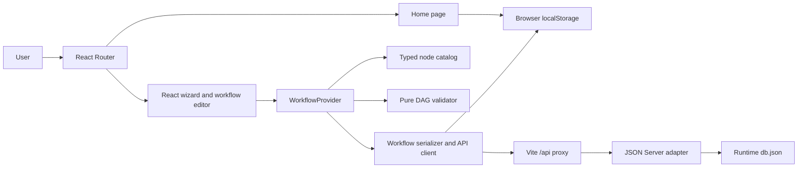

# System Overview

## Purpose

Baited Workflow Studio is a routed React application for composing campaign workflows as directed acyclic graphs. The Home route presents the product capabilities and the latest valid browser save. The editor journey then has three steps:

1. enter workflow metadata;
2. build and configure the graph;
3. review validation results and save the serialized workflow.

The editor starts empty when no valid saved record exists. A complete example can be loaded from the empty canvas. Home and Workflow are separate lazy-loaded routes.

## Architecture



The browser owns the editable draft and performs all graph validation. The mock server accepts a serialized payload and stores it; it is not a workflow engine.

## Runtime composition

```text
main.tsx
└── App
    └── RouterProvider
        ├── HomePage (/)
        │   └── SideNavigation
        └── WorkflowStudioPage (/workflow)
            └── WorkflowProvider
                └── WorkflowStudioContent
                    ├── AppHeader
                    ├── SideNavigation
                    └── WorkflowWizard
                        ├── WorkflowDetailsStep
                        ├── NodeLibrary
                        ├── WorkflowCanvas
                        ├── WorkflowPropertiesPanel
                        │   └── NodeInspector
                        └── WorkflowReviewStep
```

[`App`](../src/App.tsx) defines `/` and `/workflow`, redirects unknown routes to Home, and lazy-loads both page modules. [`WorkflowStudioPage`](../src/pages/WorkflowStudioPage.tsx) establishes the shared provider boundary only for the editor route. The wizard and editor components consume the same context through `useWorkflow`; React Flow does not own a separate canonical graph.

## Repository map

| Path | Responsibility |
| --- | --- |
| `src/pages/` | Reachable application screens |
| `src/components/layout/` | Header and side navigation shell |
| `src/components/wizard/` | Three-step workflow journey and review/save UI |
| `src/components/workflow/` | Library, canvas, nodes, inspector, and provider |
| `src/features/workflow/` | Types, catalog, initial drafts, API client, and pure validation |
| `mocks/` | JSON Server adapter and versioned empty seed |
| `tests/` | Node-based domain and API integration tests |
| `e2e/` | Playwright browser scenarios |
| `agentic/` | Markdown planning, handoff, decisions, and completed-task history |

## Technology choices

- React 19 and TypeScript for the SPA and typed domain model.
- React Router for route-aware links, browser history, lazy page boundaries, and dirty-draft blocking.
- Vite for development, proxying, and production builds.
- React Flow (`@xyflow/react`) for nodes, edges, viewport controls, and drag positioning.
- Tailwind CSS for UI styling and Lucide React for icons.
- JSON Server 0.17.4 for the local persistent HTTP mock.
- Node test runner for domain/API tests, Vitest and Testing Library for components, and Playwright plus axe for browser coverage.

## Implemented versus simulated

| Implemented | Simulated or descriptive |
| --- | --- |
| Graph editing, selection, branching, and deletion | Sending email, SMS, or IM messages |
| Home navigation and latest-save summary | Live dashboard metrics or backend aggregation |
| Typed configuration forms | Running awareness campaigns |
| DAG and configuration validation | Collecting OSINT evidence |
| Serialization and HTTP persistence | Generating real campaign content |
| Local reload recovery | Updating production target groups |

Continue with [Bootstrap and runtime](02-bootstrap-and-runtime.md) for the startup path or [Workflow blocks](04-workflow-blocks.md) for the node inventory.
