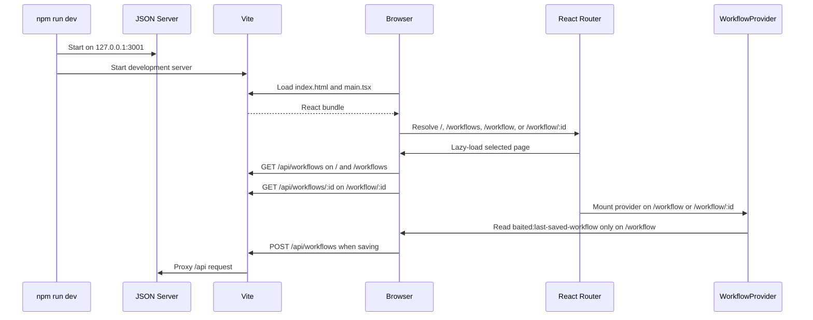

# Bootstrap and Runtime

## Quick start

The supported development entrypoint starts the frontend and mock API together:

```bash
npm install
npm run dev
```

`concurrently` launches `npm run mock:api` and `npm run dev:web`. Stopping the parent command stops both child processes.

## Startup sequence



## React bootstrap

[`src/main.tsx`](../src/main.tsx) imports global CSS and renders `App` inside `StrictMode`. [`src/App.tsx`](../src/App.tsx) creates a browser data router and lazy page boundaries:

| Route | Page | Behavior |
| --- | --- | --- |
| `/` | `HomePage` | Shows product capability copy and the latest workflow from the mock DB |
| `/workflows` | `WorkflowsPage` | Lists all mock API workflow records and links each one to `/workflow/:id` |
| `/workflow` | `WorkflowStudioPage` | Mounts provider, wizard, editor, review, and save behavior |
| `/workflow/:workflowId` | `WorkflowStudioPage` | Fetches a saved workflow by ID and opens it as the editor draft |
| Any other path | Redirect | Replaces the location with `/` |

Route-level lazy loading keeps the React Flow editor out of the initial Home chunk.

`WorkflowStudioPage` then:

- mounts `WorkflowProvider` around all workflow UI;
- composes the header, navigation, and wizard;
- derives the header title and status from the shared draft;
- confirms before replacing a dirty draft;
- registers `beforeunload` while unsaved changes exist.
- blocks SPA and browser-history navigation while unsaved changes exist, asking before proceeding.

The wizard starts on **Details**. A non-empty workflow name is required before the user can first enter the canvas step. Previously visited steps remain navigable.

## Commands

| Command | Behavior |
| --- | --- |
| `npm run dev` | Start Vite and the mock API together |
| `npm run dev:web` | Start only Vite; saving requires a reachable API target |
| `npm run mock:api` | Start only the API and retain its runtime database |
| `npm run mock:api:reset` | Replace the development database with the empty seed, then start the API |
| `npm run build` | Type-check and create the production frontend bundle |
| `npm run preview` | Preview the built frontend; `/api` still requires a reachable target |

Testing commands are covered in [Testing and development](07-testing-and-development.md).

## Ports and configuration

| Service | Default | Configuration |
| --- | --- | --- |
| Mock API | `http://127.0.0.1:3001` | `HOST`, `PORT`, or server CLI flags |
| Vite development server | Selected by Vite, normally `http://localhost:5173` | Standard Vite CLI flags |
| Vite API target | `http://127.0.0.1:3001` | `VITE_MOCK_API_TARGET` |
| Playwright frontend | `http://127.0.0.1:4173` | Fixed in `playwright.config.ts` |
| Playwright API | `http://127.0.0.1:3002` | Fixed in the E2E script/config |

Example of using another backend during frontend development:

```bash
VITE_MOCK_API_TARGET=https://api.example.test npm run dev:web
```

[`vite.config.ts`](../vite.config.ts) proxies `/api` for both development and preview. A production deployment must provide an equivalent reverse-proxy rule or otherwise serve the API under the same relative path.

## Initial draft resolution

On `/workflow/:workflowId`, the page first reads `GET /api/workflows/:id`. When the record is valid, it is converted to a draft and passed to `WorkflowProvider` as `initialDraft`. Refreshing that URL therefore reloads from the mock database, not from localStorage.

On `/workflow` without an ID, provider state is selected in this order:

1. an explicit `initialDraft` prop, primarily used by tests;
2. a valid `baited:last-saved-workflow` localStorage record restored as a draft;
3. the empty workflow draft.

Malformed or missing localStorage data is ignored. Loading the example replaces graph and metadata content but preserves the current draft identity. Starting a new workflow creates a new draft identity and clears the local saved record.

The Home route does not mount a provider. It reads `GET /api/workflows`, shows the newest mock database record, and links directly to `/workflow/:id`.

The Workflows route reads persisted records from `GET /api/workflows`. Opening an archive item links directly to `/workflow/:id`; localStorage is not used as an opening bridge.

## Runtime failure modes

- If Vite runs without the API, the editor still loads, but saving fails at `POST /api/workflows`.
- If port 3001 is occupied, the API process exits with a bind error; change `PORT` or stop the conflicting process.
- If the runtime database is invalid JSON, JSON Server cannot provide reliable persistence; reset it with `npm run mock:api:reset`.
- A production host must serve `index.html` for `/workflow`, `/workflow/:id`, and `/workflows` so browser refreshes reach the client router.
- The API has no authentication and is intended only for local development and demonstration.

See [API and persistence](06-api-and-persistence.md) for server details and [Frontend state and data flow](03-frontend-state-and-data-flow.md) for the in-browser lifecycle.
