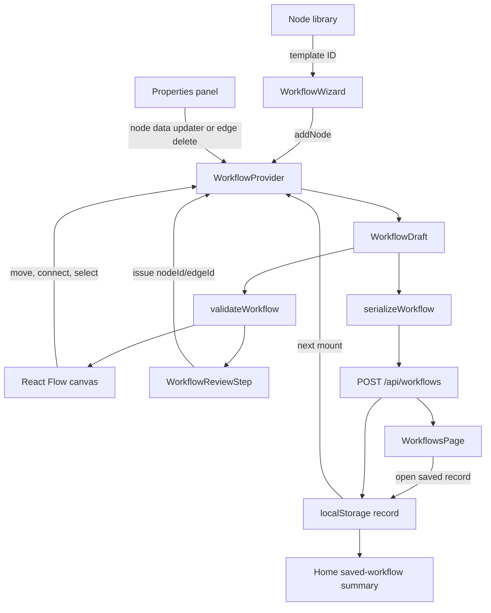

# Frontend State and Data Flow

## State ownership

[`WorkflowProvider`](../src/components/workflow/WorkflowProvider.tsx) is the canonical owner of workflow state. It exposes the typed interface declared in [`WorkflowContext.ts`](../src/features/workflow/WorkflowContext.ts).

| State | Owner | Notes |
| --- | --- | --- |
| Metadata, nodes, and edges | `WorkflowProvider` | Combined into a memoized `WorkflowDraft` |
| Draft ID, version, and status | `WorkflowProvider` | Replaced when a new or restored draft is loaded |
| Selected node | `WorkflowProvider` | Mirrored into each React Flow node's `selected` flag; mutually exclusive with selected edge |
| Selected edge | `WorkflowProvider` | Mirrored into each React Flow edge's `selected` flag; shown in the properties panel for inspection and deletion |
| Validation result | Derived in `WorkflowProvider` | Recomputed by the pure validator whenever the draft changes |
| Dirty state | Derived in `WorkflowProvider` | Serialized draft compared with the last saved snapshot |
| Current wizard step | `WorkflowWizard` | UI-only state, not serialized |
| Highest visited step | `WorkflowWizard` | Prevents jumping to unvisited future steps |
| Validation issue navigation | `WorkflowWizard` | Review actions switch back to the workflow step and select the referenced node or edge |
| React Flow instance and viewport | `WorkflowCanvas` | UI-only and omitted from the API payload |
| Save loading/error/success state | `WorkflowReviewStep` | Reducer state, separate from the draft |
| Saved-workflow archive state | `WorkflowsPage` | Loaded from `GET /api/workflows`; not owned by the editor provider |
| Current route/history blocker | React Router and `WorkflowStudioContent` | Home/editor navigation and dirty-draft confirmation |
| Latest-save Home summary | `HomePage` | Read-only projection from guarded localStorage parsing |

## Data flow

## Editor operations

The context exposes explicit operations rather than a general state setter:

- update metadata;
- add, select, update, duplicate, or remove a node;
- select or remove an edge;
- connect nodes and reconnect existing edge endpoints subject to immediate connection guards;
- apply React Flow node and edge changes;
- mark a serialized request as saved;
- start an empty workflow or load the example.

Selecting a node clears edge selection, and selecting an edge clears node selection. Removing a node also removes all incident edges and clears any selected incident edge. Duplicating a node copies its data and offsets its position by 40 pixels, but does not copy its connections.

From the review step, validation issues with a `nodeId` or `edgeId` expose a navigation action. The wizard marks the workflow step as visited, switches back to the canvas, and selects the referenced node or edge so the properties panel opens on the problematic element. Workflow-level issues without a concrete reference remain informational.

The saved-workflows archive is intentionally outside `WorkflowProvider`: it reads complete persisted mock records through the API and summarizes them. Selecting "Apri nello studio" converts the stored record into the same `SavedWorkflowRecord` shape used by localStorage restoration, then the provider loads it on `/workflow`.

## Adding and moving blocks

The library uses the custom drag MIME type `application/x-baited-node-template`. On drop, screen coordinates are converted into flow coordinates by the React Flow instance. A short spatial/time guard prevents the same pointer gesture from creating duplicate nodes.

Every library entry is also a button. Activating it by mouse, Enter, or Space adds the node at a calculated grid-like position, which is the keyboard-accessible alternative to drag-and-drop.

React Flow reports position and edge changes back to the provider. The provider remains the source of truth and supplies the resulting node and edge arrays back to the canvas.

## Connection behavior

Before accepting a connection, the provider rejects:

- missing source or target IDs;
- self-connections;
- edges that would introduce a cycle;
- connections forbidden by source/target rules;
- connections beyond input/output limits;
- duplicate source/target/branch combinations;
- a second outgoing edge from the same condition branch.

Condition edges copy the branch label and store `branchId` plus `branchType`. Editing a branch label synchronizes existing edge labels and metadata. Removing a condition rule can leave an old edge dangling; the validator reports that state instead of silently deleting the edge.

Existing connections can be selected from the canvas and inspected in the properties panel. Users can edit an existing connection by dragging either endpoint to another valid node/handle. The provider validates reconnects with the same rules as new connections while temporarily excluding the edge being moved from cardinality, duplicate, and cycle checks. Valid reconnects preserve the edge ID and selection; invalid reconnects leave the draft unchanged. Direct branch/label editing is intentionally not implemented because condition edge labels and metadata stay derived from the source branch.

## IDs

IDs are generated client-side for editor entities and server-side for saved workflows:

| Entity | Current format |
| --- | --- |
| New node | `<kind>-<Date.now()>-<in-memory sequence>` |
| New edge | `<source>-<target>-<Date.now()>-<in-memory sequence>` |
| Duplicated node | `<source-id>-copy-<Date.now()>-<in-memory sequence>` |
| Added condition rule | `rule-<Date.now()>` |
| New empty draft | `workflow-new-<Date.now()>-<in-memory sequence>` |
| Saved workflow | `workflow-<crypto.randomUUID()>` |

The in-memory counters reset on reload. These IDs are adequate for the MVP editor, but they are not a cross-device identity strategy.

## Dirty state and persistence

Dirty state is calculated by serializing the current draft and comparing its JSON string with the last saved request snapshot. Selection, validation styling, and other React Flow-only state are removed by the serializer, so they do not make the workflow dirty.

After a successful save:

1. the request and compact response are stored together in localStorage;
2. the exact request becomes the provider's clean snapshot;
3. the review reducer enters the success state.

On reload, the stored request rebuilds the editable draft and the response ID becomes its ID. The JSON Server database and localStorage serve different purposes: the database provides mock HTTP persistence, while localStorage restores the browser editor without a GET-on-mount flow.

While the editor is dirty, two guards apply:

- `beforeunload` protects refresh, tab close, and document-level navigation;
- React Router's blocker protects Home links and browser back/forward navigation inside the SPA.

The user can cancel and remain on `/workflow`, or confirm and allow the route transition. Once Home is mounted, the editor provider is unmounted; returning to the editor follows the normal localStorage restoration order. A valid saved workflow is therefore restored, while unsaved edits intentionally disappear only after confirmation.

See [Graph model and validation](05-graph-model-and-validation.md) for derived validation and [API and persistence](06-api-and-persistence.md) for the save contract.
